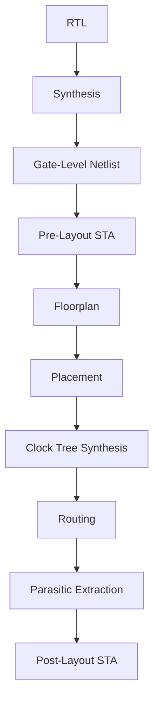
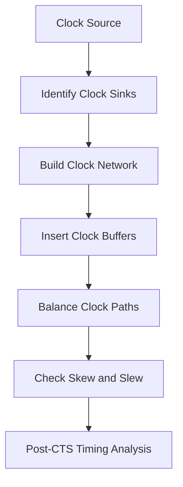
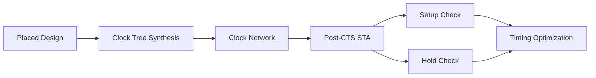
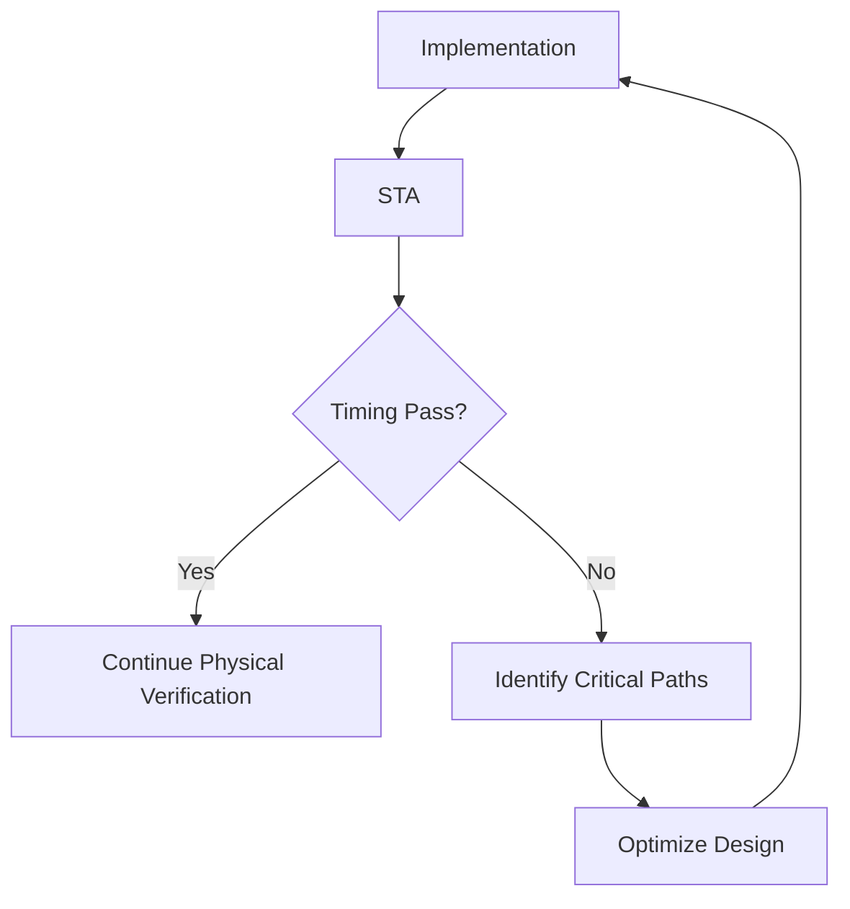
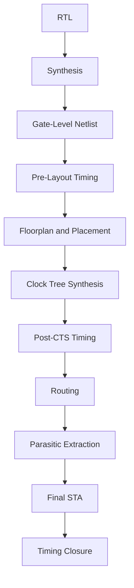

# PHYSICAL-DESIGN-DAY4


# Pre-Layout Timing Analysis and Clock Tree Design

## Overview

Timing is one of the main constraints in digital VLSI design. A circuit can be logically correct and still fail if the data does not reach the required destination within the available clock period.

In the earlier stages of physical design, the main focus is on creating the netlist, floorplan and placement. Timing analysis adds another dimension to this process by checking whether the implemented design can actually operate at the required frequency.

In this module, I studied the timing behavior of standard cells, pre-layout static timing analysis, setup and hold constraints, clock skew, clock uncertainty and the importance of a properly designed clock tree.

The main idea can be summarized as:

```text
Logic Design
     |
     v
Synthesis
     |
     v
Pre-Layout Timing Analysis
     |
     v
Placement
     |
     v
Clock Tree Synthesis
     |
     v
Post-CTS Timing Analysis
     |
     v
Routing
     |
     v
Final Timing Analysis
```

The important point is that timing is not checked only once. As more physical information becomes available, the timing analysis becomes more realistic.

---

# 1. Why Timing Analysis Is Necessary

A digital circuit has two basic requirements:

1. It must produce the correct logical result.
2. It must produce that result within the required time.

For example, consider a simple register-to-register path:

```text
        Launch Register
              |
              v
       Combinational Logic
              |
              v
        Capture Register
```

The launch register sends data after receiving a clock edge. The data then passes through the combinational logic and must reach the capture register before its required setup time.

If the data arrives too late, the circuit may produce incorrect results even though the logic itself is correct.

Therefore:

```text
Functional Correctness
          +
Timing Correctness
          =
Reliable Digital Design
```

---

# 2. Timing Through the Physical Design Flow

Timing information becomes more accurate as the design moves through physical implementation.



At the early stage, interconnect information is estimated.

After placement, actual cell locations are known.

After CTS, the clock network and its delays can be considered.

After routing, actual wire resistance, capacitance and other parasitic effects can be included.

This is why timing numbers can change during physical implementation.

---

# 3. Pre-Layout Timing Analysis

Before the design has been completely routed, timing analysis is performed using available estimates.

The timing engine uses information such as:

* Standard-cell timing models
* Logic connectivity
* Input/output constraints
* Estimated interconnect
* Clock definitions
* Operating conditions
* Process corners

A simplified representation is:

```text
Gate-Level Netlist
        |
        +---- Standard Cell Timing
        |
        +---- Clock Constraints
        |
        +---- I/O Constraints
        |
        +---- Interconnect Estimates
        |
        v
Static Timing Analysis
        |
        v
Timing Report
```

Pre-layout STA is useful because timing problems can be identified before the design reaches the final routing stage.

---

# 4. Standard-Cell Timing

Standard cells do not have one fixed delay value.

The delay of a cell depends on the conditions under which it operates.

Important parameters include:

* Input slew
* Output load
* Process
* Voltage
* Temperature
* Cell type

For example, a buffer driving a small load will normally behave differently from the same buffer driving a large load.

The basic relationship is:

```text
Input Slew + Output Load
            |
            v
      Cell Timing Model
            |
            v
        Cell Delay
```

This timing information is stored in standard-cell library files and is used by synthesis and timing-analysis tools.

---

# 5. Input Slew

Input slew describes how quickly a signal changes between logic levels.

A fast transition looks approximately like:

```text
Voltage
  |
1 |          ______
  |         /
  |        /
0 |_______/
  +-----------------> Time
```

A slower transition takes longer:

```text
Voltage
  |
1 |             _____
  |           /
  |         /
0 |________/
  +-----------------> Time
```

A slow input transition can increase the delay of the cell receiving that signal.

It can also result in a slower output transition, which can then affect the next cell in the path.

This creates a chain effect:

```text
Slow Input
    |
    v
Higher Cell Delay
    |
    v
Slow Output
    |
    v
Slower Input to Next Cell
```

---

# 6. Output Load

The output of a cell may drive one or several other cells.

The electrical load can come from:

* Input capacitance of the next cell
* Multiple fanout loads
* Wire capacitance
* Coupling capacitance
* Other parasitic components

For example:

```text
                    +----> Load 1
                    |
Driver -------------+----> Load 2
                    |
                    +----> Load 3
```

As the number or size of loads increases, the driver has to charge and discharge more capacitance.

Therefore:

```text
Higher Load
     |
     v
More Charging/Discharging
     |
     v
Larger Delay
```

---

# 7. Fanout

Fanout refers to the number of loads connected to a signal.

For example:

```text
                 +----> FF1
                 |
                 +----> FF2
Driver ----------+
                 +----> FF3
                 |
                 +----> FF4
```

This driver has four loads.

Very high fanout can cause:

* Increased capacitance
* Slower transitions
* Increased propagation delay
* Increased power
* Timing degradation

One common solution is buffer insertion.

```text
High-Fanout Signal
        |
        v
    Buffering
        |
        +----> Load Group 1
        |
        +----> Load Group 2
        |
        +----> Load Group 3
```

Instead of making one cell directly drive every load, the load can be distributed across multiple stages.

---

# 8. Cell Delay and Interconnect Delay

The delay of a timing path is not determined only by the logic cells.

A simplified expression is:

```text
Total Path Delay
=
Cell Delay
+
Interconnect Delay
```

For a longer path:

```text
Launch FF
    |
    v
Logic Cell
    |
    v
Wire
    |
    v
Logic Cell
    |
    v
Wire
    |
    v
Capture FF
```

The total delay includes the delay through every cell and the delay introduced by the interconnections.

This becomes increasingly important after placement and routing.

---

# 9. Interconnect Parasitics

Physical wires have electrical properties.

The most important parasitic quantities are:

* Resistance
* Capacitance
* Coupling capacitance

A simplified wire can be represented as:

```text
Driver ---- R ---- R ---- R ---- Receiver
             |      |      |
             C      C      C
             |      |      |
            GND    GND    GND
```

As the physical wire becomes longer, its resistance and capacitance generally increase.

Therefore:

```text
Longer Wire
     |
     v
Greater Parasitic R and C
     |
     v
Higher Interconnect Delay
```

This is one of the reasons placement and routing have a direct effect on timing.

---

# 10. Sequential Timing

Most synchronous digital designs use flip-flops to store data.

A basic timing path is:

```text
        Launch FF
            |
            v
    Combinational Logic
            |
            v
        Capture FF
```

The launch flip-flop produces data after the active clock edge.

That data travels through the combinational logic and must reach the capture flip-flop at the correct time.

Two major constraints have to be checked:

* Setup timing
* Hold timing

---

# 11. Clock-to-Q Delay

When a clock edge reaches the launch flip-flop, its output does not change instantaneously.

The delay between the clock edge and the corresponding output transition is called **clock-to-Q delay**.

```text
Clock
__________/‾‾‾‾‾‾‾‾‾‾‾


Q
____________/‾‾‾‾‾‾‾‾‾
             ^
             |
        Clock-to-Q
```

A register-to-register path therefore contains at least:

```text
Clock-to-Q Delay
       +
Combinational Delay
       +
Interconnect Delay
       +
Capture Register Requirement
```

---

# 12. Setup Time

Setup time is the minimum amount of time for which the input data must remain stable **before** the active clock edge.

Consider:

```text
Data
-------------------- stable ------------------

Clock
__________________________/‾‾‾‾‾‾‾‾‾‾‾
                          ^
                          |
                    Capture Edge
```

The data must arrive early enough for the receiving flip-flop to capture it correctly.

A simplified setup relationship is:

```text
Clock Period
    >=
Clock-to-Q
+
Combinational Delay
+
Interconnect Delay
+
Setup Time
+
Clock Uncertainty
```

If the data arrives after the required arrival time, a setup violation occurs.

---

# 13. Setup Violation

A setup violation means that the data path is too slow for the available clock period.

```text
Data arrives too late
          |
          v
Setup requirement not satisfied
          |
          v
Setup violation
```

Typical causes include:

* Too much combinational logic
* Slow standard cells
* Large output load
* High fanout
* Long interconnect
* Poor placement
* Clock uncertainty

Possible timing fixes include:

* Upsizing cells
* Buffer insertion
* Reducing logic depth
* Improving placement
* Reducing wire length
* Optimizing the clock network

---

# 14. Hold Time

Hold time is different from setup time.

It specifies how long the data must remain stable **after** the active clock edge.

```text
Clock
____________________/‾‾‾‾‾‾‾‾‾‾‾
                    ^
                    |
               Capture Edge

Data
--------------------|-------------------
                    |
                    +--- Hold Window
```

If new data reaches the capture register too quickly, the previous value may not be held long enough.

That produces a hold violation.

The simple distinction is:

```text
Setup Violation = Data arrives too late

Hold Violation  = Data changes too early
```

---

# 15. Setup vs Hold

| Parameter      | Setup               | Hold                      |
| -------------- | ------------------- | ------------------------- |
| Concern        | Data arriving late  | Data arriving too early   |
| Time reference | Before clock edge   | After clock edge          |
| Typical issue  | Long/slow data path | Very short/fast data path |
| Common fix     | Speed up data path  | Add delay to data path    |

This distinction is important when interpreting STA reports.

A path that is good for setup is not automatically guaranteed to be good for hold.

Both checks have to pass.

---

# 16. Clock as a Timing Signal

The clock is different from an ordinary data signal because it controls when sequential elements sample data.

Ideally, the same clock edge would reach all flip-flops at exactly the same time.

In a real chip, however, the clock travels through physical interconnect and buffers.

Therefore, different registers can receive the clock at slightly different times.

This difference is called **clock skew**.

---

# 17. Ideal Clock

Before Clock Tree Synthesis, the clock can be treated as ideal for timing analysis.

Conceptually:

```text
                 Clock
                   |
          +--------+--------+
          |        |        |
          v        v        v
         FF1      FF2      FF3
```

The ideal model assumes approximately equal clock arrival times.

This is useful for early timing analysis because the physical clock network has not yet been created.

However, it does not represent the final physical implementation.

---

# 18. Why a Clock Tree Is Required

A real clock signal has to reach a large number of sequential elements.

Connecting every flip-flop directly to a single source is not practical.

A clock tree distributes the signal through multiple buffer stages.

A simplified structure is:

```text
                 Clock Source
                      |
                    Buffer
                   /      \
                  /        \
             Buffer        Buffer
             /   \          /   \
            /     \        /     \
          FF1     FF2    FF3     FF4
```

The objective is to distribute the clock while controlling:

* Clock latency
* Skew
* Transition time
* Power
* Signal integrity

This process is called **Clock Tree Synthesis**, or CTS.

---

# 19. Clock Tree Synthesis

CTS inserts and sizes clock buffers so that the clock reaches the required sequential elements with acceptable timing characteristics.

A simplified CTS flow is:



CTS is therefore not simply about making a tree-shaped structure.

The clock network must satisfy electrical and timing constraints.

---

# 20. Clock Latency

Clock latency is the time taken for the clock signal to travel from its source to a particular sequential element.

For example:

```text
Clock Source
     |
     | 2 ns
     v
   FF1
```

The clock latency to FF1 is approximately 2 ns in this simplified example.

Different registers can have different latencies because their physical locations and clock paths are different.

---

# 21. Clock Skew

Clock skew is the difference between the clock arrival times at two sequential elements.

For example:

```text
Clock Source
     |
     +----------> FF1
     |             |
     |          2.0 ns
     |
     +----------> FF2
                   |
                2.3 ns
```

The skew is approximately:

```text
2.3 ns - 2.0 ns = 0.3 ns
```

The actual impact of skew depends on whether the receiving clock arrives earlier or later relative to the launching clock.

---

# 22. Why Clock Skew Matters

Clock skew changes the effective timing relationship between launch and capture registers.

Consider:

```text
Launch FF -------- Data Path -------- Capture FF
     |                                  |
     +----------- Clock ----------------+
```

If the clock does not reach the two registers at the same time, the available timing window changes.

Therefore, skew can influence both:

* Setup timing
* Hold timing

This is why CTS and timing analysis are closely connected.

---

# 23. Clock Uncertainty

Clock uncertainty represents timing variation or margin that cannot be treated as perfectly deterministic.

It can account for effects such as:

* Clock jitter
* Variation
* Modeling margin
* Other clock-related uncertainties

A simplified setup equation can include it as:

```text
Available Time
=
Clock Period
-
Clock Uncertainty
```

Therefore, increasing clock uncertainty effectively reduces the timing margin available to the data path.

---

# 24. Clock Slew

The clock signal also has a transition time.

A clock edge that is too slow can cause timing and power problems.

```text
Good Clock Transition

       ______
      /
_____/
```

versus:

```text
Slow Clock Transition

          ______
        /
      /
____/
```

CTS therefore needs to control clock transition quality as well as skew.

If a clock net has excessive load, additional buffering may be required.

---

# 25. Clock Tree and Power

Clock networks can consume a significant amount of dynamic power because the clock switches continuously during operation.

Every clock buffer and clock wire contributes capacitance.

Therefore:

```text
More Clock Buffers
        +
More Clock Wire
        |
        v
Higher Clock Capacitance
        |
        v
Higher Dynamic Power
```

CTS has to balance timing requirements with power considerations.

---

# 26. Pre-CTS and Post-CTS Timing

The timing model changes significantly when CTS is performed.

### Before CTS

The clock is usually treated as ideal or estimated.

```text
Ideal Clock
     |
     +----> Launch FF
     |
     +----> Capture FF
```

### After CTS

The actual clock network is represented.

```text
Clock Source
     |
   Buffer
   /    \
  /      \
FF1      Buffer
           |
           FF2
```

Now the timing engine can account for:

* Clock latency
* Clock skew
* Clock buffer delay
* Clock transition
* Clock network effects

---

# 27. Post-CTS Static Timing Analysis

After CTS, timing analysis is repeated.

The main purpose is to determine whether the actual clock network has introduced new timing problems.

The flow is:



The results are then used to determine whether further optimization is necessary.

---

# 28. Timing Slack

Slack indicates how much timing margin is available.

For setup timing:

```text
Setup Slack
=
Required Arrival Time
-
Actual Arrival Time
```

If the result is positive, there is timing margin.

If the result is negative, the path violates the setup requirement.

Similarly, hold analysis compares the actual arrival time with the minimum required arrival time.

A simplified interpretation is:

```text
Positive Slack  -> Timing requirement satisfied
Negative Slack  -> Timing violation
```

---

# 29. Critical Path

The critical path is the path with the smallest timing margin for a particular timing check.

A simplified path is:

```text
Launch FF
    |
    v
Logic 1
    |
    v
Logic 2
    |
    v
Logic 3
    |
    v
Capture FF
```

If this path has very little slack, even a small additional delay can cause a violation.

Timing optimization therefore focuses heavily on critical and near-critical paths.

---

# 30. Timing Optimization

When a timing violation is identified, several approaches can be considered.

For setup problems:

```text
Setup Violation
      |
      +----> Cell Upsizing
      |
      +----> Buffering
      |
      +----> Logic Optimization
      |
      +----> Placement Improvement
      |
      +----> Reduce Interconnect
      |
      +----> Clock Optimization
```

For hold problems:

```text
Hold Violation
      |
      +----> Add Delay
      |
      +----> Buffer Insertion
      |
      +----> Cell Adjustment
      |
      +----> Clock Optimization
```

The appropriate solution depends on the actual timing report and physical constraints.

---

# 31. Timing Closure

Timing closure is the process of repeatedly analyzing and optimizing the design until the required timing constraints are satisfied.

A simplified loop is:



Timing closure is therefore an iterative process rather than a single tool command.

---

# 32. Main Factors Affecting Timing

The important factors studied in this module can be grouped into three categories.

### Cell-related

* Cell delay
* Input slew
* Output load
* Drive strength
* Fanout

### Interconnect-related

* Wire length
* Resistance
* Capacitance
* Coupling
* Routing congestion

### Clock-related

* Clock latency
* Clock skew
* Clock uncertainty
* Clock slew
* Clock-tree structure

These factors interact with each other, which is why timing optimization can require changes at multiple levels.

---

# 33. Overall Timing Analysis Flow

The complete concept can be summarized as:

```text
              Gate-Level Netlist
                      |
                      v
             Timing Constraints
                      |
                      v
              Pre-Layout STA
                      |
                      v
                 Placement
                      |
                      v
               Clock Tree
                      |
                      v
                Post-CTS STA
                      |
                      v
                  Routing
                      |
                      v
            Parasitic Extraction
                      |
                      v
              Final STA
                      |
                      v
              Timing Closure
```

At every stage, more accurate physical information becomes available.

---

# 34. Key Learnings

The main points I took away from this module are:

1. Logical correctness alone does not guarantee a working high-speed digital design.
2. Timing depends on both standard-cell behavior and physical interconnect.
3. Input slew and output load strongly affect cell delay.
4. High fanout can increase delay and degrade signal transitions.
5. Interconnect resistance and capacitance become increasingly important after physical implementation.
6. Setup checks ensure that data arrives early enough before the capture edge.
7. Hold checks ensure that data does not change too soon after the capture edge.
8. Clock-to-Q delay contributes to the data-path timing budget.
9. An ideal clock is useful for early analysis but does not represent the final physical clock network.
10. CTS creates a physical clock-distribution network.
11. Clock skew changes the timing relationship between sequential elements.
12. Clock uncertainty reduces available timing margin.
13. Post-CTS STA is necessary because the clock network introduces real delays.
14. Timing violations can require both logical and physical optimization.
15. Timing closure is an iterative process involving analysis, optimization and re-analysis.

---

# 35. Final Understanding

The main idea from this module is that timing analysis has to follow the physical design as it develops.

At the beginning, the timing engine has mainly logical and library information. Once placement is available, physical distances can be estimated. After CTS, the clock network becomes part of the timing problem. Finally, routing and parasitic extraction provide a more realistic representation of the actual interconnect.

The overall relationship is:

```text
Logical Design
      |
      v
Cell Timing
      |
      v
Physical Placement
      |
      v
Interconnect Effects
      |
      v
Clock Tree
      |
      v
Skew and Uncertainty
      |
      v
Static Timing Analysis
      |
      v
Optimization
      |
      v
Timing Closure
```

Understanding this flow makes it easier to interpret STA reports and understand why a design that passes timing before physical implementation can still fail after placement, CTS or routing.

The important takeaway is that timing is not an isolated verification step. It is continuously connected to synthesis, placement, clock-tree design, routing and physical optimization throughout the ASIC flow.

---

## Tools and Concepts

| Area               | Concepts / Tools                               |
| ------------------ | ---------------------------------------------- |
| Synthesis          | Gate-level netlist                             |
| Timing             | Static Timing Analysis                         |
| Libraries          | Liberty timing models                          |
| Physical Design    | Floorplanning and Placement                    |
| Clock              | Clock Tree Synthesis                           |
| Analysis           | Setup, Hold, Slack                             |
| Interconnect       | Resistance, Capacitance, Coupling              |
| Optimization       | Buffering, Cell sizing, Placement optimization |
| Final Verification | Post-route STA                                 |

---

## Module Flow



---

## Conclusion

Pre-layout timing analysis provides an early indication of whether the synthesized design can meet its timing requirements. As the design becomes physically implemented, additional effects such as wire delay, clock latency, skew and parasitics become part of the analysis.

Clock Tree Synthesis is especially important because the clock controls the timing relationship between sequential elements. A well-balanced clock network helps maintain controlled skew and acceptable transition characteristics while avoiding unnecessary power and area overhead.

By studying pre-CTS and post-CTS timing together, the connection between logical design, physical implementation and timing closure becomes much clearer.

